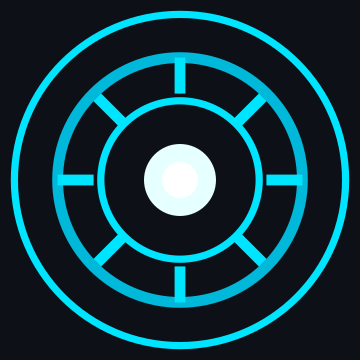

<div align="center">




<br>

<a href="https://github.com/SaurabhLokhande2408">

</a>
<a href="https://www.linkedin.com/in/saurabh-lokhande-111459376">

</a>
<a href="https://leetcode.com/u/Saurabh_Lokhande/">

</a>

</div>

---

## About Me

I'm **Saurabh Lokhande**, a **2nd-year Computer Science Engineering student** exploring **AI/ML in depth**.

Started with full-stack and backend development, now moving deeper into ML fundamentals and the basics behind them.

```text
Currently learning
├── Data Structures & Algorithms (just started)
├── Machine Learning
└── RAG
```

---

## Tech Stack

**Languages:** Python · C++ · Java (Basics → OOP)

**Backend:** FastAPI · JWT (using FastAPI) · REST APIs · SQLAlchemy

**Frontend:** React

**Data / ML:** NumPy · Pandas · Matplotlib · scikit-learn

**Database:** PostgreSQL

---

## Achievements

* 🏆 2nd Prize — Hult Prize, On Campus
* 🥉 3rd Place — Eureka! Startup Pitch Competition, On Campus
* 🚀 Selected for next round at IIT Bombay — Eureka!
* 💻 9 Hackathons Participated
* 🚀 3 Startup Pitch Competitions Participated

---

## Stats

<div align="center">


</div>

---

## Connect

<div align="center">

<a href="https://github.com/SaurabhLokhande2408">

</a>

<a href="https://www.linkedin.com/in/saurabh-lokhande-111459376">

</a>

<a href="https://leetcode.com/u/Saurabh_Lokhande/">

</a>

</div>

<br>

<div align="center">


</div>
